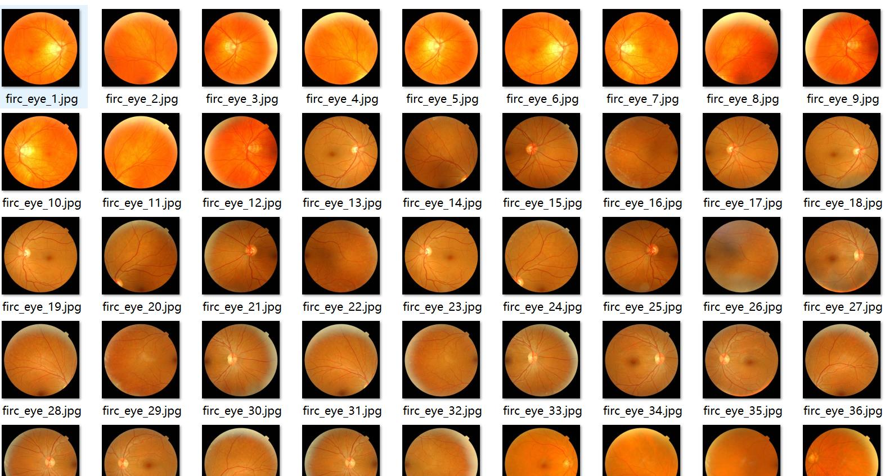
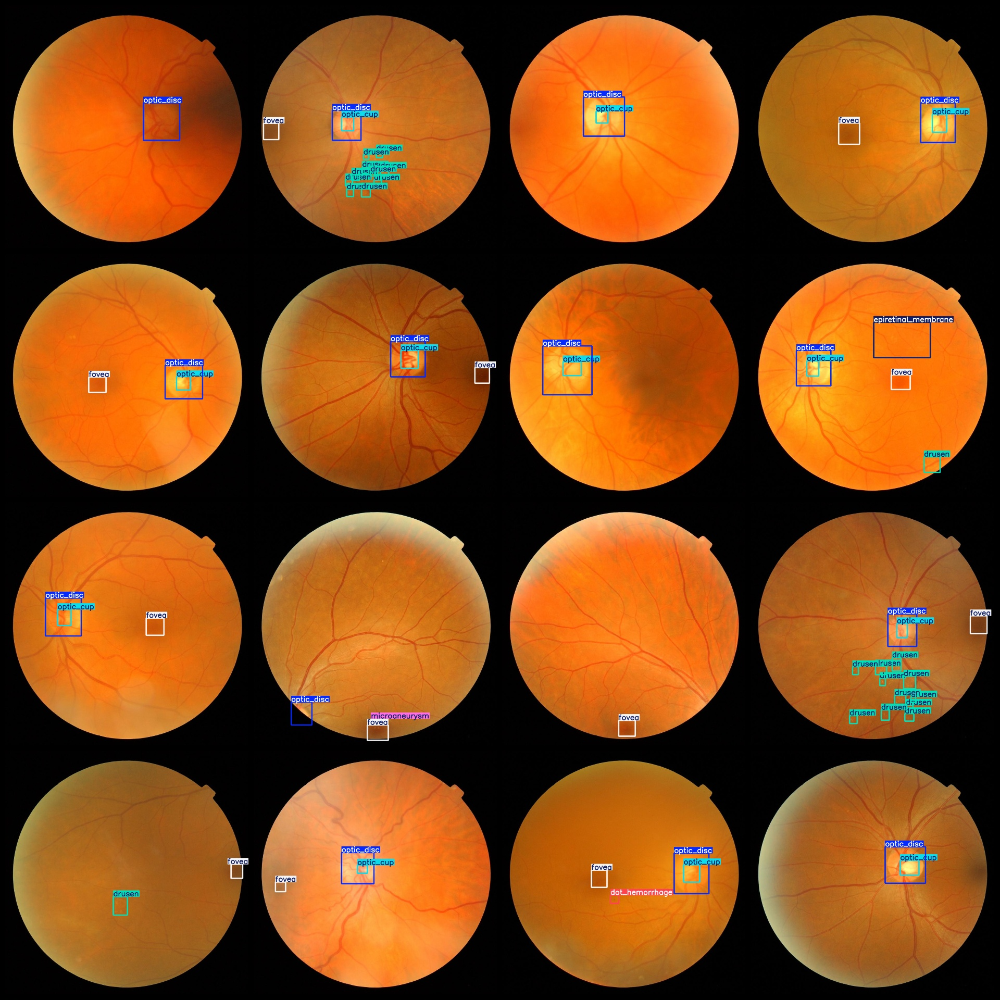
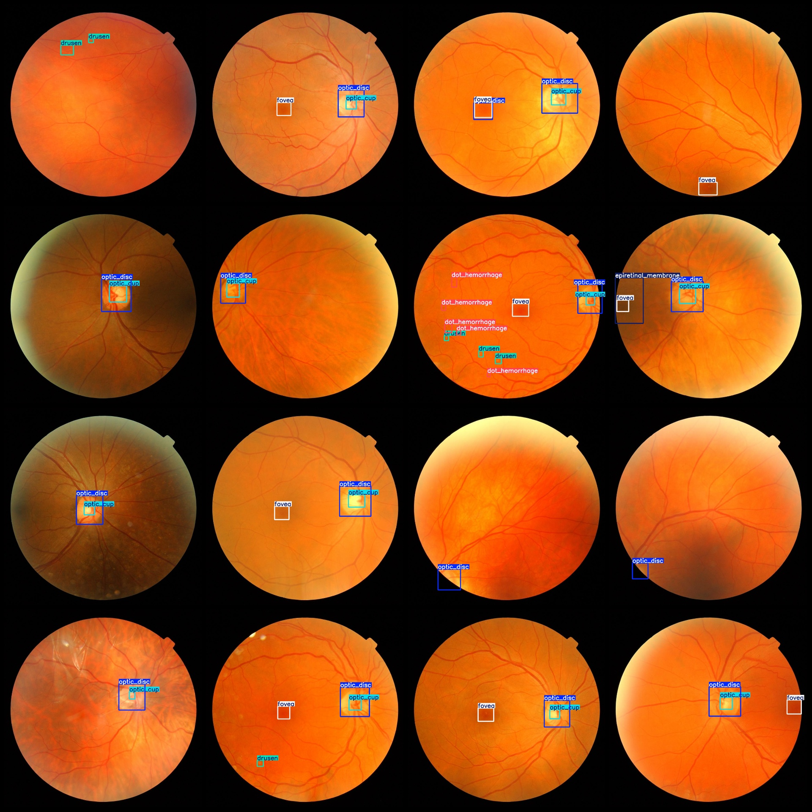

# Vision in the Context of Intelligent Medical Diabetes Retinopathy Detection Dataset with VOC+YOLO Format, 482 Images in 16 Categories

dataset format: Pascal VOC format + YOLO format (txt files without split path, only contain jpg images and corresponding VOC format xml files and yolo format txt files)
Number of images (number of jpg files): 482
The number of XML files is 482.
annotation count: 482  
annotationnumber of classes: 16  
["artefact","blot_hemorrhage","choroidal_nevus","cotton_wool_spot","dot_hemorrhage","drusen","epiretinal_membrane","flame_shaped_hemorrhage","fovea","hard_exudates","microaneurysm","myelinated_nerve_fibre_layer","optic_cup","optic_disc","pigmentation","roth_spot"]
Number of boxes annotated per category:
The answer is 25.
Blot hemorrhage (spotted bleeding) frame count = 19
Choroidal nevus (choroidal nevi) Frame Count = 18
Cotton wool spot (cotton wool spots) Frame Count = 3
The dot hemorrhage (point hemorrhage) frame count is 159.
Drusen (Glass Fiber Papules) Frame Count = 278
Epiretinal membrane (ERM) is a thin layer of tissue that covers the inner surface of the retina and forms an indentation in the vitreous humor. This membrane can cause problems such as floaters, blurred vision, and macular degeneration. The number of ERMs present in the eye can vary depending on the severity of the condition. In some cases, multiple ERMs may be present, which can increase the risk of complications.
The number of frames in the "flame-shaped hemorrhage" (fire-shaped bleeding) frame is 7.
1. Fovea (Center Hole) Frame Count = 387
2. Hard exudates (Hard exudate) Frame Count = 4
3. Microaneurysm (Microaneurysm) Frame Count = 24
4. Myelinated nerve fiber layer (Myelinated Nerve Fiber Layer) Frame Count = 5
5. Optic cup (Optic Cup) Frame Count = 298
6. Optic disc (Optic Disk) Frame Count = 356
7. Pigmentation (Pigmentation) Frame Count = 8
8. Roth spot (Roth spot) Frame Count = 3
Total Frame Count: 1616
Each category's image count:
Artefact (Pseudo-artifact) Image Count = 9
Blot hemorrhage (Spot-like hemorrhage) Image Count = 15
Choriomalacia (Nevus of the retina) Image Count = 16
Cotton wool spot (Cotton wool spot) Image Count = 3
Dot hemorrhage (Dot-like hemorrhage) Image Count = 51
Drusen, also known as senile cataracts, are small opaque deposits in the lens of the eye that can cause vision impairment and blurred vision. They occur due to aging and can be seen on a retinal photograph.
Epiretinal Membrane (22 images)
Flame-shaped Hemorrhage (7 images)
The fovea (central sulcus) has 383 pictures.
hard_exudates images = 2
microaneurysm images = 16
myelinated_nerve_fibre_layer images = 4
optic_cup images = 290
optic_disc images = 350
Pigmentation is a term used to describe the process of the skin's natural ability to produce and store melanin, which gives our skin its color. The number of pigmentation spots on an image refers to the number of pixels or dots that contain melanin. In this case, there are 8 pigmentation spots in the image.
The number of images that roth_spot (Roth spot) owns = 3.
image resolution: 1000x1000
## Images

Here is a pay link on Stripe ( https://buy.stripe.com/3cs8yP7sY87d0vu9AB ). Please contact me lonlonago@foxmail.com after funding $89, and I will send you a complete data files , thank you!

